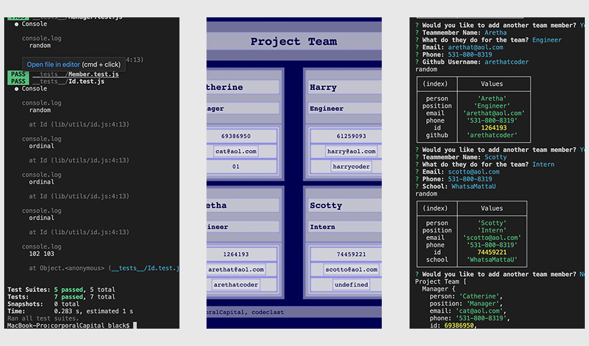

# corporalCapital 1.0
  

  

  ## OVERVIEW:
   A rolodex website generator. This facilitates making a webpage to log teammember information. Using a simple command line series of questions, it builds a website with clickable links.
   Screencast runthrough: https://watch.screencastify.com/v/xW7AptK7SB95emwtv1WM

  ## Table Of Contents:
  [Installation](README.md#installation) 
  [Usage](README.md#usage) 
  [Tests](README.md#tests) 
  [Credits](README.md#credits) 
  [Questions](README.md#questions) 
  [License](README.md#license) 

  ## Installation
  This requires node, fs, inquirer to run, as well as all of the associated dependencies

  ## Usage
  After installing require dependencies, the user types 'node index' and then follows all of the prompts. After the file is created the user should copy the 'dist' folder into whereever they would like to deploy the webpage.

  ## Tests
  the tests folder will test all of the included objects if there are any bugs, using Jest.

  ## Credits
  Thanks to the writers of node, fs, inquirer and all of the dependant code which made this possible.

  ## Questions
  [Becket, Codeclast](becketbowes@gmail.com)
  [Github Page](http://www.github.com/becketbowes)

  ## License
  [Creative Commons Attribution License, Sat Feb 26 2022 14:23:18 GMT-0500 (Eastern Standard Time)](https://creativecommons.org/licenses/by/4.0/legalcode)
